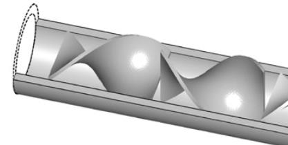
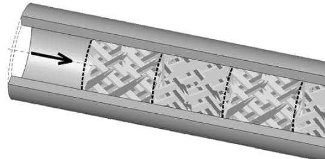
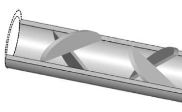

Table 1 – Price and tensile strength comparison of polyester, vinyl ester and epoxy resins

<table align="center">
    <tr align="center" style="font-weight: 800;">
        <td rowspan="2">Resin Family</td> 
        <td>Average price</td> 
        <td>Tensile Strength</td> 
        <td>Stiffness</td> 
   </tr>
   <tr align="center" style="font-weight: 800;">
        <td >($/lb)</td>  
        <td>(MPa)[35]</td>  
        <td>(Gpa)[35]</td>  
   </tr>
   <tr align="center">
        <td>Polyerstre</td> 
        <td>2-3</td> 
        <td>6.4</td>
        <td>2.8</td>
   </tr>
   <tr align="center">
        <td>Vinyl Ester</td> 
        <td>3-8</td> 
        <td>7.6</td>
        <td>3.0</td>
   </tr>
   <tr align="center">
        <td>Epoxy</td> 
        <td>5-30</td> 
        <td>8.1</td>
        <td>3.3</td>
   </tr>
</table>

表1-聚酯、乙烯基树脂及环氧树脂的价格和强度对比

<table align="center">
    <tr align="center" style="font-weight: 800;">
        <td rowspan="2">树脂类型</td> 
        <td>平均价格</td> 
        <td>拉伸强度</td> 
        <td>刚度</td> 
   </tr>
   <tr align="center" style="font-weight: 800;">
        <td >($/lb)</td>  
        <td>(MPa)[35]</td>  
        <td>(Gpa)[35]</td>  
   </tr>
   <tr align="center">
        <td>聚酯</td> 
        <td>2-3</td> 
        <td>6.4</td>
        <td>2.8</td>
   </tr>
   <tr align="center">
        <td>乙烯基树脂</td> 
        <td>3-8</td> 
        <td>7.6</td>
        <td>3.0</td>
   </tr>
   <tr align="center">
        <td>环氧树脂</td> 
        <td>5-30</td> 
        <td>8.1</td>
        <td>3.3</td>
   </tr>
</table>

***

Table 2 – Common additives and fillers and their effect on resin properties

<table align="center">
    <tr align="center" style="font-weight: 800;">
        <td ></td> 
        <td></td> 
        <td>Effect on resin properties </td> 
        <td>Reference</td> 
   </tr>
   <tr align="center">
        <td rowspan="3" style="font-weight: 800;">Additive</td>  
        <td>Nanoclay</td>  
        <td>Improved toughness, flexural strength and modulus, tensile strength and modulus</td> 
        <td>[41], [42]</td>   
   </tr>
   <tr align="center">
        <td >Phosphorus</td> 
        <td>Flame retardancy</td> 
        <td>[43]</td>
   </tr>
   <tr align="center">
        <td>Carbon black</td> 
        <td>UV protection</td> 
        <td>[44]</td>
   </tr>
   <tr align="center">
        <td rowspan="4" style="font-weight: 800;">Filler</td> 
        <td>Glass microspheres</td> 
        <td>Weight reduction and stiffness increase, reduced shrinkage1</td>
        <td>[45], [46]</td>
   </tr>
   <tr align="center">
        <td>Calcium carbonate</td> 
        <td>Increased crosslinking density and stiffness</td> 
        <td>[47]</td>
   </tr>
   <tr align="center">
        <td>Milled carbon or glass fibers </td> 
        <td>Improved mechanical properties </td> 
        <td>[48]</td>
   </tr>
   <tr align="center">
        <td>Talc </td> 
        <td>Thermal stability and reduced shrinkage </td> 
        <td>[49]</td>
   </tr>
</table>

表2 常用的添加剂和填料及其对树脂性能的影响

<table align="center">
    <tr align="center" style="font-weight: 800;">
        <td ></td> 
        <td></td> 
        <td>对树脂性能的影响 </td> 
        <td>参考文献</td> 
   </tr>
   <tr align="center">
        <td rowspan="3" style="font-weight: 800;">添加剂</td>  
        <td>纳米黏土</td>  
        <td>改善材料韧性，拉伸强度和模量，弯曲强度和模量</td> 
        <td>[41], [42]</td>   
   </tr>
   <tr align="center">
        <td >磷</td> 
        <td>阻燃性</td> 
        <td>[43]</td>
   </tr>
   <tr align="center">
        <td>炭黑</td> 
        <td>防紫外线</td> 
        <td>[44]</td>
   </tr>
   <tr align="center">
        <td rowspan="4" style="font-weight: 800;">填料</td> 
        <td>玻璃微珠</td> 
        <td>减重、增加刚度、降低收缩率</td>
        <td>[45], [46]</td>
   </tr>
   <tr align="center">
        <td>碳酸钙</td> 
        <td>增加交联密度和刚度</td> 
        <td>[47]</td>
   </tr>
   <tr align="center">
        <td>碳纤或玻纤粉末 </td> 
        <td>改善力学性能</td> 
        <td>[48]</td>
   </tr>
   <tr align="center">
        <td>滑石粉</td> 
        <td>提高热稳定性并降低收缩率 </td> 
        <td>[49]</td>
   </tr>
</table>

***

Table 3 - Advantages and disadvantages of mix homogeneity characterization methods

<table align="center">
    <tr align="center" style="font-weight: 800;">
        <td >Characterization method</td> 
        <td>Advantages</td> 
        <td>Disadvantages </td>  
   </tr>
   <tr >
        <td align="center" >FTIR Spectroscopy</td>  
        <td><ul>
          <li>Versatile and widely used to characterize chemical compounds</li>
          <li>The data obtained can be linked to the concentration of the samples and homogeneity</li>
        </ul></td>  
        <td><ul>
          <li>Usually employed as a qualitative characterization method</li>
        </ul></td>   
   </tr>
   <tr >
        <td align="center">Mechanical testing </td> 
        <td><ul>
          <li>Equipment easily accessible</li>
        </ul></td>   
        <td><ul>
          <li>It is hard to derive the relations between the mechanical properties of a sample to the homogeneity (intensity of segregation)</li>
        </ul></td>  
   </tr>
   <tr >
        <td align="center">DSC</td> 
        <td><ul>
          <li>Results are precise and can be linked to the resin to hardener ratio</li>
        </ul></td>  
        <td><ul>
          <li>Testing is relatively slow and expensive to perform</li>
        </ul></td> 
   </tr>
   <tr >
        <td align="center">TGA</td> 
        <td><ul>
          <li>Results can be linked to the resin to hardener ratio</li>
        </ul></td>  
        <td><ul>
          <li>It is hard to derive the relations between the TGA results of a sample to the homogeneity (intensity of segregation)</li>
        </ul></td> 
   </tr>
   <tr >
        <td align="center">Electrical testing</td> 
        <td><ul>
          <li>N/A</li>
        </ul></td>  
        <td><ul>
          <li>Cannot be applied to all substances and results cannot be explicitly linked to the mixing ratio and homogeneity of a sample</li>
        </ul></td> 
   </tr>
   <tr >
        <td align="center">Spectrophotometry</td> 
        <td><ul>
          <li>Results can directly be associated with the homogeneity of a sample</li>
        </ul></td>  
        <td><ul>
          <li>Only applies to samples that show colour differences between the components</li>
        </ul></td> 
   </tr>
</table>

表3-混合均匀性表征方法的优缺点

<table align="center">
    <tr align="center" style="font-weight: 800;">
        <td >表征方法</td> 
        <td>优点</td> 
        <td>缺点 </td>  
   </tr>
   <tr >
        <td align="center" >红外光谱</td>  
        <td><ul>
          <li>用途广泛，通常用于化学成分表征</li>
          <li>The data obtained can be linked to the concentration of the samples and homogeneity</li>
        </ul></td>  
        <td><ul>
          <li>通常只能用来做定性表征</li>
        </ul></td>   
   </tr>
   <tr >
        <td align="center">力学测试 </td> 
        <td><ul>
          <li>测试设备比较常见</li>
        </ul></td>   
        <td><ul>
          <li>很难通过样品的力学性能来推导其混合均匀性（偏析强度）</li>
        </ul></td>  
   </tr>
   <tr >
        <td align="center">DSC</td> 
        <td><ul>
          <li>Results are precise and can be linked to the resin to hardener ratio</li>
        </ul></td>  
        <td><ul>
          <li>Testing is relatively slow and expensive to perform</li>
        </ul></td> 
   </tr>
   <tr >
        <td align="center">TGA</td> 
        <td><ul>
          <li>Results can be linked to the resin to hardener ratio</li>
        </ul></td>  
        <td><ul>
          <li>It is hard to derive the relations between the TGA results of a sample to the homogeneity (intensity of segregation)</li>
        </ul></td> 
   </tr>
   <tr >
        <td align="center">Electrical testing</td> 
        <td><ul>
          <li>N/A</li>
        </ul></td>  
        <td><ul>
          <li>Cannot be applied to all substances and results cannot be explicitly linked to the mixing ratio and homogeneity of a sample</li>
        </ul></td> 
   </tr>
   <tr >
        <td align="center">Spectrophotometry</td> 
        <td><ul>
          <li>Results can directly be associated with the homogeneity of a sample</li>
        </ul></td>  
        <td><ul>
          <li>Only applies to samples that show colour differences between the components</li>
        </ul></td> 
   </tr>
</table>

***

Table 4 – Popular types of static mixers

<table align="center">
     <tr align="center" style="font-weight: 800;">
        <td >Type/Name</td> 
        <td>3D model[73]</td> 
     </tr>
     <tr align="center">
        <td >Kenics (twisted blades)</td> 
        <td></td> 
     </tr>
     <tr align="center">
        <td >SMX (Static Mixer using crossbars X)</td> 
        <td></td> 
     </tr>
     <tr align="center">
        <td >LPD (Low Pressure Drop)</td> 
        <td></td> 
     </tr>
</table>

***

Table 5 - Mixing performance analysis of static mixers

<table align="center">
     <tr align="center" style="font-weight: 800;">
        <td ></td> 
        <td >ΔP(MPa)</td>
        <td >Mean  shear rate (s-1)</td>
        <td >Interfacial stretching</td>
        <td >Intensity of segregation</td> 
     </tr>
     <tr align="center">
        <td style="font-weight: 800;">Kenics</td>
        <td>0.71</td>
        <td>10</td>
        <td>0.57</td>
        <td>0.57</td>
     </tr>
     <tr align="center">
        <td style="font-weight: 800;">LPD</td>
        <td>0.75</td>
        <td>8.8</td>
        <td>0.54</td>
        <td>0.6</td>
     </tr>
     <tr align="center">
        <td style="font-weight: 800;">SMX</td>
        <td>1.8</td>
        <td>21</td>
        <td>4.2</td>
        <td>0.13</td>
     </tr>
</table>

***

Table 6 – Pressure drop and interfacial stretch of different static mixers

<table align="center">
     <tr align="center" style="font-weight: 800;">
        <td rowspan="2">Mixer type </td> 
        <td rowspan="2">ΔP/element  </td>
        <td colspan="2">Interfaces produced</td>
     </tr>
     <tr align="center">
          <td>Scheme 1: expected</td>
          <td>Scheme 2: actual</td>
     </tr>
     <tr align="center">
          <td>Kenics (RL-180°) </td>
          <td>5.5</td>
          <td>2Nelem</td>
          <td>4Nelem-1</td>
     </tr>
     <tr align="center">
          <td>LPD (RL-90°) </td>
          <td>8.5</td>
          <td>3Nelem</td>
          <td>2Nelem</td>
     </tr>
     <tr align="center">
          <td>SMX (2, 3, 8, 90°)</td>
          <td>38</td>
          <td>8Nelem-1</td>
          <td>5Nelem</td>
     </tr>
</table> 

***

Table 7 - Comparison of static, dynamic and impingement mixers

<table align="center">
     <tr align="center">
          <td>Mixing technology</td>
          <td>Advantage</td>
          <td>Disadvantage</td>
     </tr>
     <tr align="center">
          <td>Static</td>
          <td><ul>
               <li>Simple design</li>
               <li>Inexpensive</li>
               <li>Wide range of viscosities</li>
               <li>Does not require an external energy source</li>
          </ul></td>
          <td><ul>
               <li>May create a significant pressure drop</li>
          </ul></td>
     </tr>
     <tr align="center">
          <td>Dynamic</td>
          <td><ul>
               <li>Reduced pressure drop  </li>
          </ul></td>
          <td><ul>
               <li>Complex design</li>
               <li>High purchasing and maintenance costs</li>
          </ul></td>
     </tr>
     <tr align="center">
          <td>Impingement </td>
          <td><ul>
               <li>High output flow rate and pressure capabilities</li>
               <li>Short fluid residence time for rapid chemical reactions</li>
          </ul></td>
          <td><ul>
               <li>High purchasing costs</li>
          </ul></td>
     </tr>
</table>

***

Table 8 - Project relevant flammable gas and vapour classification definitions in Canada

<table>
     <tr align="center" style="font-weight: 800;">
          <td>Division and Zones Classification</td>
          <td>Definition [92]</td>
     </tr>
     <tr align="center">
          <td>Division 1</td>
          <td>The explosive mixture of gas or vapour and air may exist under normal operating conditions.</td>
     </tr>
     <tr align="center">
          <td>Division 2*</td>
          <td>The explosive mixture of gas or vapour and air may exist under abnormal conditions such as accidental rupture of a vessel or container or failure of a ventilating system.</td>
     </tr>
</table>

***

Table 9 - Reviewed metering and mixing system technical data

<table align="center">
     <tr align="center" style="font-weight: 800;">
          <td></td>
          <td>Mahr MarMax</td>
          <td>Tartler Nodopur</td>
          <td>Cannon B-System</td>
          <td>Meter Mix PAR 200</td>
          <td>DOPAG compomix</td>
     </tr>
     <tr align="center">
          <td style="font-weight: 800;">Reference</td>
          <td>3</td>
          <td>4</td>
          <td>[95]</td>
          <td>5</td>
          <td>5</td>
     </tr>
     <tr align="center">
          <td style="font-weight: 800;">Viscosity (cP)</td>
          <td>up to 85000*</td>
          <td>Virtually no limit*</td>
          <td>5000</td>
          <td>up to 1500000*</td>
          <td>1 to 50000*</td>
     </tr>
     <tr align="center">
          <td style="font-weight: 800;">Mixing ratio</td>
          <td></td>
          <td></td>
          <td></td>
          <td></td>
          <td></td>
     </tr>
     <tr align="center">
          <td style="font-weight: 800;">Flow rate(ml/min)</td>
          <td></td>
          <td></td>
          <td></td>
          <td></td>
          <td></td>
     </tr>
     <tr align="center">
          <td style="font-weight: 800;">Highly abrasive fluids capability</td>
          <td></td>
          <td></td>
          <td></td>
          <td></td>
          <td></td>
     </tr>
     <tr align="center">
          <td style="font-weight: 800;">Mixing technology</td>
          <td></td>
          <td></td>
          <td></td>
          <td></td>
          <td></td>
     </tr>
     <tr align="center">
          <td style="font-weight: 800;">Pump technology</td>
          <td></td>
          <td></td>
          <td></td>
          <td></td>
          <td></td>
     </tr>
     <tr align="center">
          <td style="font-weight: 800;">Wetted parts material</td>
          <td></td>
          <td></td>
          <td></td>
          <td></td>
          <td></td>
     </tr>
     <tr align="center">
          <td style="font-weight: 800;">Class 1 Div.1 Hazardous locations certified</td>
          <td>YesS</td>
          <td>No</td>
          <td>YesS</td>
          <td>No</td>
          <td>YesS</td>
     </tr>
</table>